# BÁO CÁO ĐỒ ÁN: TỐI ƯU HÓA KIẾN TRÚC LENET-5 TRÊN ĐA TẬP DỮ LIỆU

Mục tiêu của báo cáo là đánh giá lộ trình cải tiến LeNet-5 trên ba miền dữ liệu MNIST Handwritten, FashionMNIST và PneumoniaMNIST, đồng thời đối chiếu giá trị lịch sử của thiết kế gốc với hiệu quả trong bối cảnh mô hình hiện đại.

---

## 1. Baseline

### 1.1 Kiến trúc LeNet-5 cổ điển
- LeNet-5 gốc sử dụng chuỗi C-S-C-S-FC với Tanh, Average Pooling và kết nối thưa ở lớp tích chập trung gian.
- Hai thành phần đặc trưng nhất so với CNN hiện đại là:
  - sparse connection (thay vì dense Conv2d như hiện nay),
  - Dùng hoàn toàn Average Pooling (thay vì Max Pooling).

Kiến trúc LeNet-5 cổ điển:
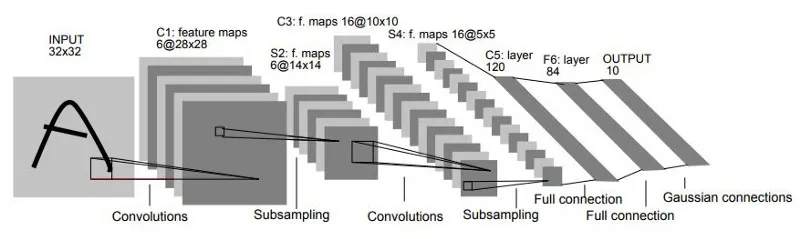
Nguồn: http://vision.stanford.edu/cs598_spring07/papers/Lecun98.pdf

Bảng parse feature maps của LeNet-5:
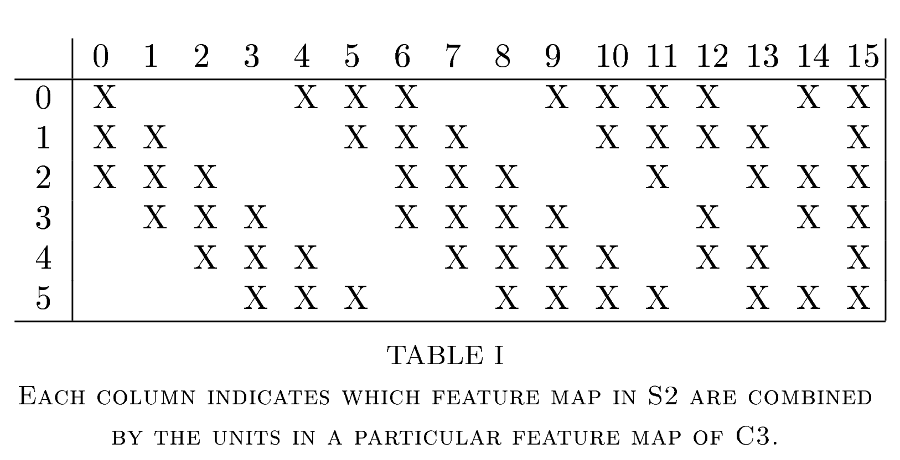

### 1.2 Ý nghĩa kỹ thuật của parse feature maps
- Lớp C3 không nhận toàn bộ feature maps từ S2; mỗi bộ lọc C3 chỉ kết nối với một tập con kênh đầu vào.
- Mục tiêu lịch sử của thiết kế này là giảm số tham số và phù hợp giới hạn phần cứng thập niên 90.
- Trong bối cảnh hiện đại, đối tượng dữ liệu phức tạp hơn và phần cứng mạnh hơn, kết nối dense thường cho khả năng tương tác liên kênh tốt hơn.

---

## 2. Baseline cải tiến hiện đại

### 2.1 Thay đổi kiến trúc
- Chuyển Tanh -> ReLU.
- Chuyển Average Pooling -> Max Pooling.
- Bổ sung BatchNorm/Dropout để ổn định quá trình tối ưu.
- Loại bỏ kết nối thưa thủ công, dùng Conv2d dense trong phiên bản cải tiến.

### 2.2 Kỳ vọng và rủi ro
- Kỳ vọng: hội tụ nhanh hơn, gradient ổn định hơn, giảm hiện tượng bão hòa kích hoạt.
- Rủi ro: khi mở rộng sức chứa mạng, mô hình dễ học vẹt hơn nếu không kiểm soát bằng regularization và theo dõi learning curves.

---

## 3. Cải tiến cụ thể cho từng dataset

### 3.1 MNIST Handwritten
- Kết quả qua các mốc: 98.99 (Classic) -> 99.09 (Modernized) -> 99.17 (evaluate trong notebook cải tiến).
- Mức tăng +0.10 rồi +0.08 (tổng +0.18) cho thấy hiệu ứng trần: bài toán đã rất gần giới hạn với họ LeNet.
- Hàm ý: trên MNIST, cải tiến chủ yếu đem lại ổn định hội tụ, ít tạo bước nhảy lớn về Accuracy.

### 3.2 FashionMNIST
- Chiến lược: RandomRotation(10), Adam lr=0.001, và đối chiếu Wide 5x5 với Wide 3x3.
- Baseline đạt quanh 89% (89.45 và 89.97), trong khi Wide đạt >92% (92.55 và 92.26).
- Diễn giải: mở rộng kênh 32 -> 64 -> 256 giúp mô hình học tốt hơn các cặp lớp dễ nhầm lẫn (ví dụ Shirt/T-shirt).

### 3.3 PneumoniaMNIST
- Chiến lược trung tâm: class weighting trong CrossEntropyLoss để xử lý mất cân bằng nhãn.
- Bổ trợ tiền xử lý: ColorJitter(contrast=0.5).
- Kết quả tăng mạnh từ baseline (84.29/83.65) lên nhóm advanced (89.42/90.22).
- Ngoài Accuracy, các chỉ số weighted F1/Recall/Precision trong notebook 3 nằm quanh 0.89-0.91.

### 3.4 Tại sao Wide 5x5 nhỉnh hơn Wide 3x3 trên bộ dữ liệu này?
- Ảnh gốc là 28x28, pipeline huấn luyện được đưa về 32x32.
- Ở lớp đầu tiên:
  - kernel 5x5 quan sát 5/32 = 15.6% theo chiều rộng ảnh,
  - kernel 3x3 quan sát 3/32 = 9.4% theo chiều rộng ảnh.
- Theo diện tích của một cửa sổ quét:
  - 5x5: 25/1024 = 2.44%,
  - 3x3: 9/1024 = 0.88%.
- Như vậy, 5x5 có vùng quan sát tức thời lớn hơn 25/9 ~= 2.78 lần ở lớp đầu, giúp bắt cấu trúc vĩ mô sớm hơn (phom dáng trang phục, cấu trúc lồng ngực trong X-quang).
- Kết quả thực nghiệm hiện tại phù hợp lập luận này: 5x5 nhỉnh hơn nhẹ trên FashionMNIST và PneumoniaMNIST. Tuy nhiên, khoảng cách còn nhỏ, cần lặp lại nhiều lần để kết luận chặt chẽ hơn.

---

## 4. Kết quả và nhận xét

### 4.1 Bảng tổng hợp duy nhất

| Mô hình | MNIST Acc (%) | Fashion Acc (%) | Pneumonia Acc (%) | Pneumonia F1 | Pneumonia Recall |
| :--- | :---: | :---: | :---: | :---: | :---: |
| Classic LeNet | 98.99 | 89.45 | 84.29 | N/A | N/A |
| Modernized Baseline | 99.09 | 89.97 | 83.65 | N/A | N/A |
| LeNet-Wide 5x5 | N/A | 92.55 | 90.22 | 0.90 (weighted) | 0.90 (weighted) |
| LeNet-Wide 3x3 | N/A | 92.26 | 89.42 | 0.89 (weighted) | 0.89 (weighted) |

Ghi chú:
- N/A được dùng cho các ô mà notebook hiện tại không cung cấp trực tiếp số liệu tương ứng cho đúng biến thể trên đúng dataset.
- Chỉ số Recall trong bảng là weighted recall từ output notebook. Phân tích recall lớp dương tính (có bệnh) được ưu tiên ở mục 4.4.

### 4.2 Nhận xét tổng quát theo lộ trình cải tiến
- Trên MNIST, cải tiến kiến trúc không tạo bước nhảy lớn do đã gần trần hiệu suất.
- Trên FashionMNIST, mở rộng sức chứa (Wide) mang lại cải thiện rõ nét so với baseline.
- Trên PneumoniaMNIST, class weighting là thành phần quyết định để nâng hiệu quả.

### 4.3 Nguy cơ overfitting của mô hình Wide
- Cấu hình Wide tăng kênh đến 256 và tăng FC lên 1024, làm số tham số tăng mạnh (có thể đến mức nhiều lần so với baseline).
- Vì dữ liệu ảnh 32x32 gọn nhẹ, mô hình có nguy cơ học vẹt nếu chỉ nhìn Accuracy cuối cùng.
- Vì vậy, learning curves (train/test hoặc train/val) là bằng chứng bắt buộc để xác nhận mô hình không quá khớp.
- Trong báo cáo cuối cùng, cần đặt learning curves cạnh nhau cho Classic, Modernized, Wide 5x5 và Wide 3x3 trên từng dataset.

### 4.4 Ưu tiên metric y tế: Recall lớp dương tính (Pneumonia)
- Trong bài toán y tế, false negative (bỏ sót ca bệnh) nguy hiểm hơn false positive.
- Do đó, Accuracy 90.22% không đủ để kết luận chất lượng hệ thống.
- Báo cáo cần tách riêng recall của lớp Positive (Pneumonia) từ confusion matrix, thay vì chỉ dựa weighted recall.
- Yêu cầu triển khai bắt buộc trong bản cuối: bổ sung bảng confusion matrix và phân tích FN/TP cho từng biến thể Wide.

### 4.5 Minh họa trực quan bắt buộc đưa vào báo cáo
- [ ] Confusion matrices theo cặp so sánh (Classic vs Modernized, Wide 5x5 vs Wide 3x3).
- [x] Learning curves đặt cạnh nhau để chứng minh kiểm soát overfitting.
- [x] Misclassified samples của mô hình tốt nhất (đã bổ sung cho 3 dataset).

### 4.6 Learning curves minh họa (trích từ Notebooks/figure)

MNIST Handwritten:

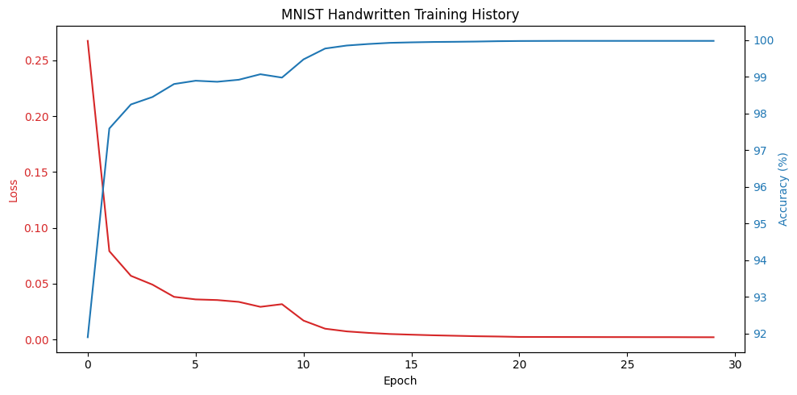
*Chú thích: Learning curve của mô hình Classic LeNet trên MNIST Handwritten.*

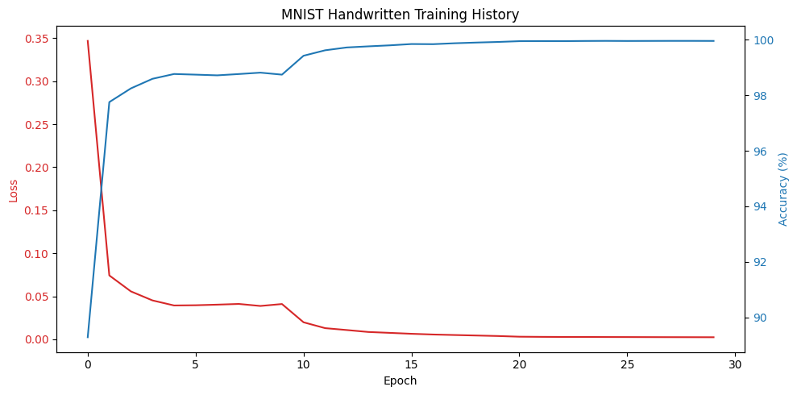
*Chú thích: Learning curve của mô hình Modernized Baseline trên MNIST Handwritten.*

FashionMNIST:

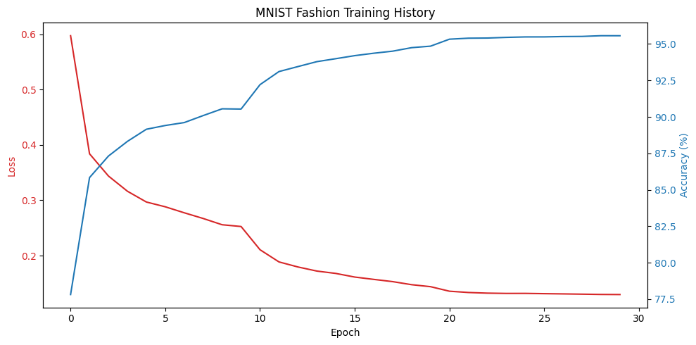
*Chú thích: Learning curve của mô hình Classic LeNet trên FashionMNIST.*

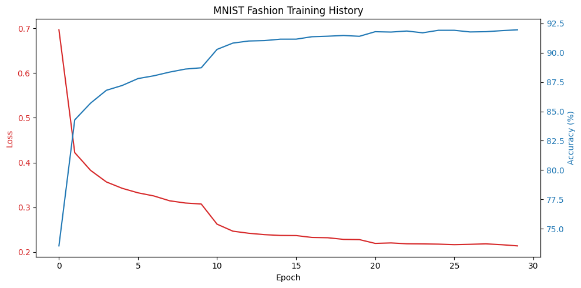
*Chú thích: Learning curve của mô hình Modernized Baseline trên FashionMNIST.*

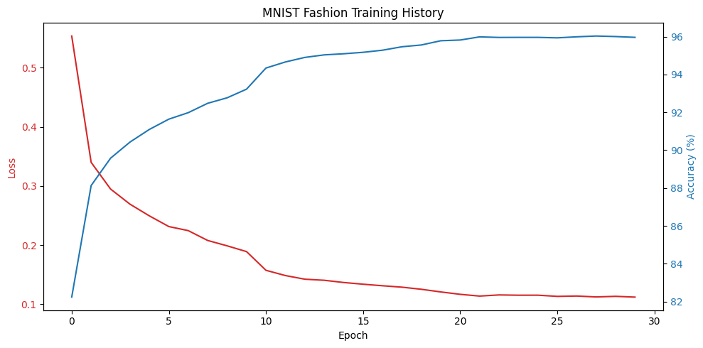
*Chú thích: Learning curve của LeNet-Wide 5x5 trên FashionMNIST.*

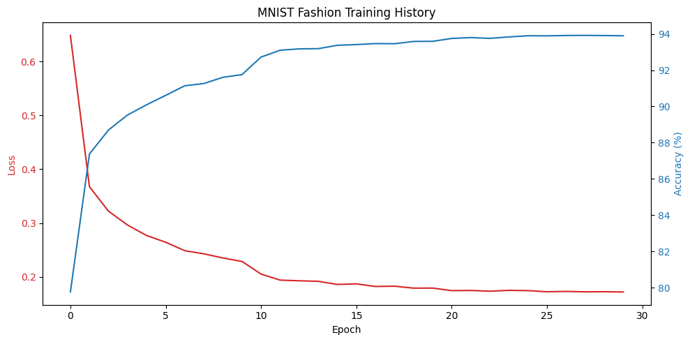
*Chú thích: Learning curve của LeNet-Wide 3x3 trên FashionMNIST.*

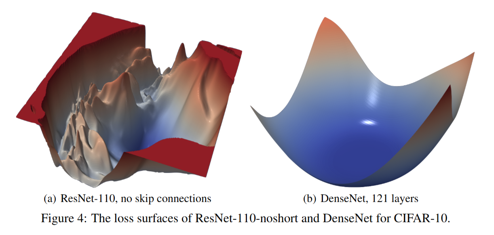

PneumoniaMNIST:

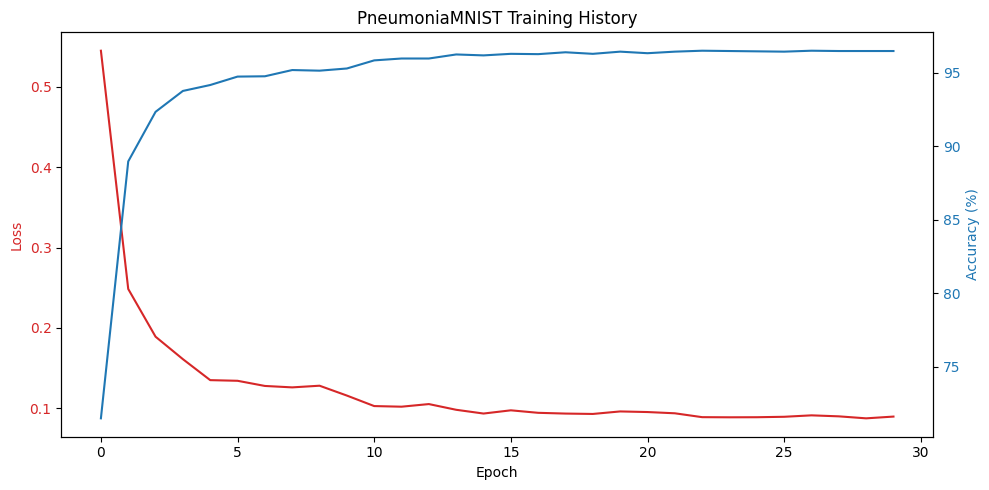
*Chú thích: Learning curve của mô hình Classic LeNet trên PneumoniaMNIST.*

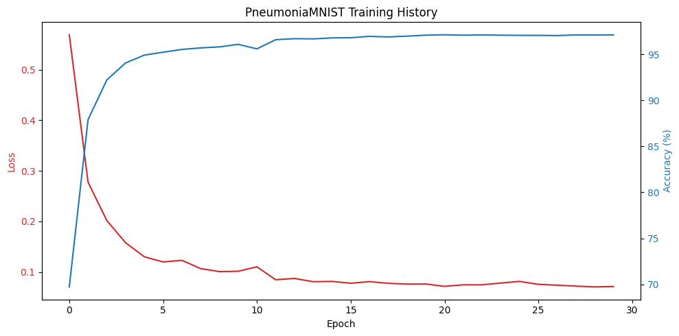
*Chú thích: Learning curve của mô hình Modernized Baseline trên PneumoniaMNIST.*

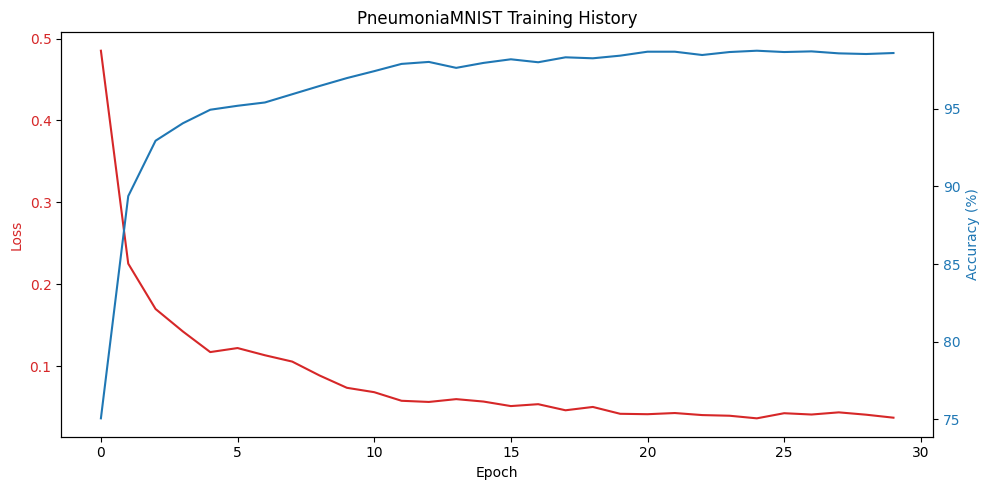
*Chú thích: Learning curve của LeNet-Wide 5x5 trên PneumoniaMNIST.*

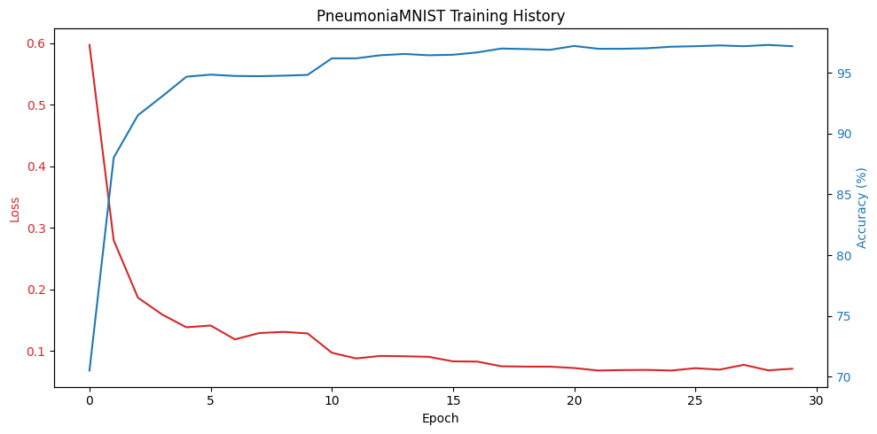
*Chú thích: Learning curve của LeNet-Wide 3x3 trên PneumoniaMNIST.*

### 4.7 Mẫu phân loại sai của mô hình tốt nhất

MNIST Handwritten (mô hình tốt nhất):

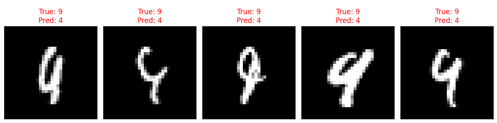
*Chú thích: Ví dụ mẫu sai trên MNIST: nhãn thật là 9 nhưng mô hình dự đoán thành 4.*

Nhận xét: Trường hợp sai này thường xuất hiện khi nét viết mờ hoặc hình dáng chữ số nằm ở vùng giao thoa hình học giữa hai lớp.

FashionMNIST (mô hình tốt nhất):

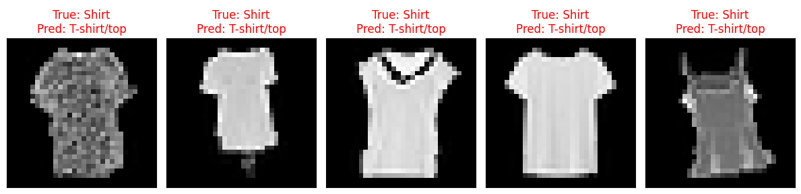
*Chú thích: Mẫu sai FashionMNIST: nhãn thật Shirt nhưng dự đoán thành T-shirt/top.*

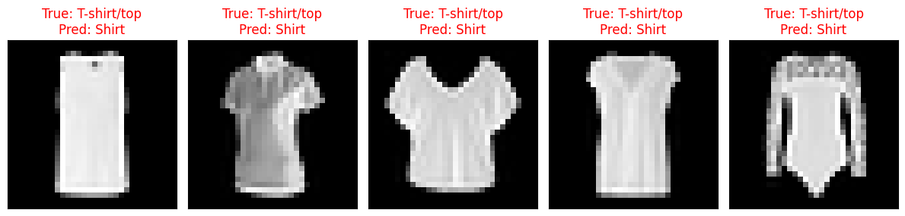
*Chú thích: Mẫu sai FashionMNIST: nhãn thật T-shirt/top nhưng dự đoán thành Shirt.*

Nhận xét: Hai lớp Shirt và T-shirt/top có biên quyết định rất gần nhau về hình dạng tổng thể, nên vẫn là cặp nhầm lẫn chính ngay cả với mô hình tốt nhất.

PneumoniaMNIST (mô hình tốt nhất):

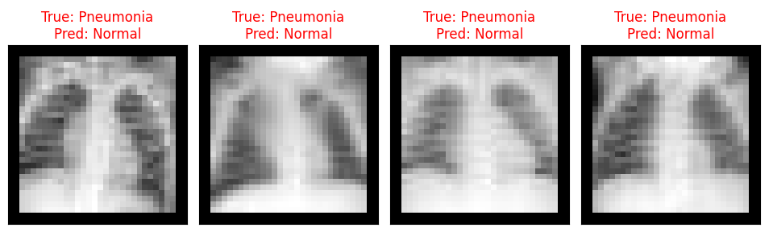
*Chú thích: Mẫu sai y tế nghiêm trọng: nhãn thật Pneumonia nhưng dự đoán thành Normal (false negative).* 

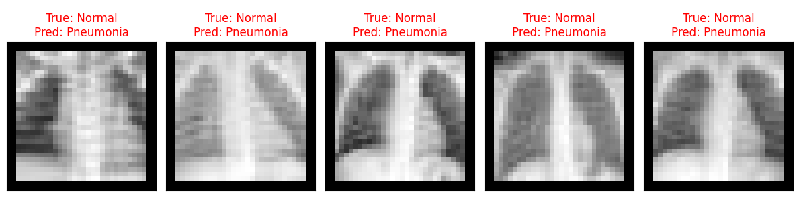
*Chú thích: Mẫu sai còn lại: nhãn thật Normal nhưng dự đoán thành Pneumonia (false positive).* 

Nhận xét: Trong bối cảnh y tế, false negative cần được ưu tiên giảm thiểu hơn false positive. Vì vậy, phần đánh giá cuối cần tiếp tục nhấn mạnh recall của lớp Pneumonia cùng với phân tích confusion matrix.

---

## 5. Kết luận

- Lộ trình cải tiến cho thấy LeNet-5 vẫn là một mốc baseline mạnh, nhưng cần mở rộng kiến trúc và chiến lược học để xử lý dữ liệu phức tạp hơn.
- Wide 5x5 nhỉnh hơn Wide 3x3 trong lần chạy hiện tại trên FashionMNIST và PneumoniaMNIST; lập luận receptive field trên ảnh 32x32 giải thích hợp lý cho xu hướng này.
- Tuy nhiên, kết luận cuối cùng cần được ràng buộc bởi bằng chứng overfitting (learning curves) và metric y tế ưu tiên (recall lớp dương tính), không chỉ dựa vào Accuracy.

---

## 6. Tham khảo

1. LeCun, Y., Bottou, L., Bengio, Y., and Haffner, P. (1998). Gradient-Based Learning Applied to Document Recognition. Proceedings of the IEEE, 86(11), 2278-2324.
2. Krizhevsky, A., Sutskever, I., and Hinton, G. E. (2012). ImageNet Classification with Deep Convolutional Neural Networks. NeurIPS.
3. Ioffe, S., and Szegedy, C. (2015). Batch Normalization: Accelerating Deep Network Training by Reducing Internal Covariate Shift. ICML.
4. Srivastava, N., Hinton, G., Krizhevsky, A., Sutskever, I., and Salakhutdinov, R. (2014). Dropout: A Simple Way to Prevent Neural Networks from Overfitting. JMLR.
5. Simonyan, K., and Zisserman, A. (2015). Very Deep Convolutional Networks for Large-Scale Image Recognition. ICLR.
6. Yang, J., Shi, R., and Wei, D. (2021). MedMNIST v2: A Large-Scale Lightweight Benchmark for 2D and 3D Biomedical Image Classification. Scientific Data.
7. Saito, T., and Rehmsmeier, M. (2015). The Precision-Recall Plot Is More Informative than the ROC Plot When Evaluating Binary Classifiers on Imbalanced Datasets. PLOS ONE.
